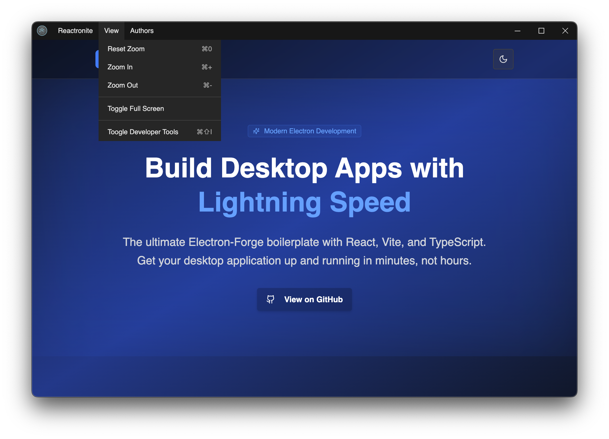
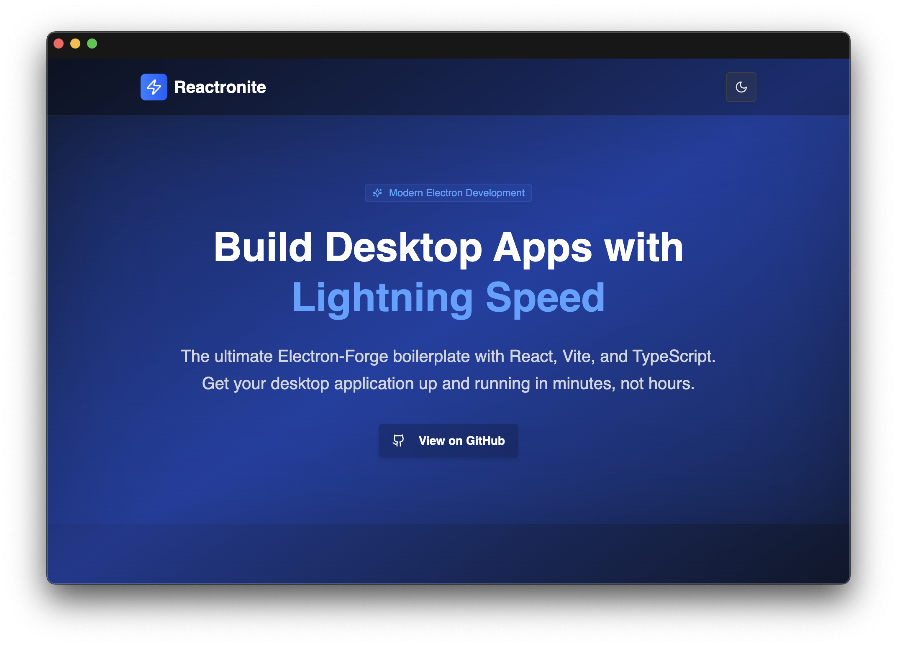

# ⚛ Reactronite ⚛

<div align="center">

[](https://opensource.org/licenses/MIT)
[](https://www.typescriptlang.org/)
[](https://reactjs.org/)
[](https://electronjs.org/)
[](https://vitejs.dev/)

**A modern, feature-rich Electron kit for building cross-platform desktop applications with React and Vite**

[Features](#-features) • [Quick Start](#-quick-start) • [Deployment Modes](#-deployment-modes) • [Configuration](#-configuration) • [Contributing](#-contributing)

</div>




---

## 🎯 Overview

The **Reactronite** is your ultimate starting point for creating modern, performant desktop applications. This carefully crafted template combines the power of Electron with the speed of Vite, the flexibility of React, and the safety of TypeScript to deliver an exceptional development experience.

### Why This Kit?

- 🏗️ **Production-Ready Architecture** - Clean, scalable project structure with separation of concerns
- ⚡ **Lightning Fast Development** - Hot Module Replacement (HMR) with Vite for instant feedback
- 🎨 **Native Desktop Experience** - Custom titlebar and native-feeling UI components
- 🛡️ **Type Safety First** - Full TypeScript support with strict type checking
- 🔧 **Developer Experience** - Pre-configured linting, formatting, and git hooks
- 📦 **Zero Configuration** - Ready to code out of the box with sensible defaults

## ✨ Features

### 🎨 **User Interface & Experience**

- **Custom Titlebar** - Native-looking titlebar with integrated window controls
- **Responsive Design** - Adaptive layouts that work across different screen sizes
- **Modern Styling** - TailwindCSS v4 styling system with theme support
- **Cross-Platform Consistency** - Unified experience across Windows, macOS, and Linux

### 🔧 **Development Tools**

- **Hot Module Replacement** - Instant updates during development
- **TypeScript Integration** - Full type safety with excellent IntelliSense support
- **Code Quality Tools** - Integrated ESLint and [neostandard](https://github.com/neostandard/neostandard) for linting
- **Git Hooks** - Automated code quality checks with Husky
- **Path Mapping** - Clean imports with TypeScript path resolution

### 🏗️ **Architecture & Security**

- **Deployment Modes** - The machine's state is read from disk and switches tabs, screens and IPC channels on or off ([details](#-deployment-modes))
- **Secure IPC Communication** - Safe main-renderer process communication
- **Context Isolation** - Properly isolated preload scripts
- **Window State Management** - Remembers window size, position, and state
- **Auto-updater Ready** - Built with Electron Forge for easy distribution

### 📦 **Build & Distribution**

- **Multi-Platform Building** - Build for Windows, macOS, and Linux from any platform
- **Optimized Bundles** - Tree-shaking and code splitting for smaller app sizes
- **Auto-Packaging** - One-command building and packaging
- **Distribution Ready** - Pre-configured makers for various package formats

## 🚀 Quick Start

### Prerequisites

Make sure you have the following installed:

- **Node.js** (LTS or higher)
- **pnpm** (v10 or higher) - This project uses pnpm as the package manager

### Installation

1. **Clone the repository**

   ```bash
   git clone https://github.com/flaviodelgrosso/reactronite.git
   cd reactronite
   ```

2. **Install dependencies**

   ```bash
   pnpm install
   ```

3. **Start development**

   ```bash
   pnpm dev
   ```

That's it! Your application will launch in development mode with hot reloading enabled.

### Available Scripts

| Command | Description |
|---------|-------------|
| `pnpm dev` | Start the app in development mode with hot reloading |
| `pnpm package` | Package the app for the current platform |
| `pnpm make` | Create distributable packages for the current platform |
| `pnpm publish` | Publish the app (configure publishers in forge.config.ts) |

## 🚦 Deployment Modes

The machine this app is deployed on can be in one of several states - connected
to the lab, standalone, in a classroom, under maintenance. The app reads that
state from a plain text file on disk at startup and uses it to turn **tabs,
screens, buttons and IPC channels** on or off.

Nothing hard-codes "is this feature on": every part of the app asks the same
resolved state, and the main process enforces it.

> Full reference: [`docs/deployment-modes.md`](./docs/deployment-modes.md)

### How the mode is chosen

First hit wins:

| # | Source | Example |
|---|--------|---------|
| 1 | `LIBVIRT_UI_MODE` env var | `LIBVIRT_UI_MODE=training pnpm dev` |
| 2 | `--mode=<id>` switch | `libvirt-ui --mode=standalone` |
| 3 | **The mode file** | `/etc/libvirt-ui/mode` (Linux), `%PROGRAMDATA%\libvirt-ui\mode` (Windows), `/Library/Application Support/libvirt-ui/mode` (macOS), any path in `LIBVIRT_UI_MODE_FILE`, or `<userData>/mode` |
| 4 | `defaultMode` in `config/modes.yaml` | `full` |

The mode file is a single line naming the mode:

```txt
standalone
```

`mode: standalone` works too, and `#` comments are ignored. The file is polled,
so changing the machine's state updates the running app - **no restart**:

```bash
cat /etc/libvirt-ui/mode                      # what state is this machine in?
echo maintenance | sudo tee /etc/libvirt-ui/mode   # takes effect in ~5s
```

If the file names a mode that does not exist, the app falls back to the default
mode and shows a warning badge in the tab bar - it never starts up blank.

### What a mode means

The file on disk only names a mode. `config/modes.yaml` defines what that name
allows:

```yaml
defaultMode: full

defaults:          # applied to every mode, then overridden per mode
  dashboard: true
  tools: true
  vms: true
  remoteVms: true
  webApps: true
  rules: true
  api: true
  devTools: false

modes:
  standalone:
    label: Standalone
    description: No connectivity to the lab API. Local VMs and tools only.
    features:
      remoteVms: false
      webApps: false
      rules: false
      api: false
```

| Mode | What it is for |
|------|----------------|
| `full` | Connected to the lab - everything available |
| `standalone` | No lab API - local VMs and tools only |
| `training` | Classroom build - tools and web apps, no VM lifecycle control |
| `maintenance` | Machine being serviced - dashboard only |

Feature ids live in `src/modes/features.ts` and are typed, so a typo is a
compile error in code and a load-time warning in YAML. That file also carries a
built-in copy of the catalog, so a missing or broken `modes.yaml` still yields a
working app instead of a blank window.

### Using it in the UI

The main process resolves the mode **before** the window is created and hands it
to the preload script, so the first render already knows what is enabled - no
loading state, no flash of features that are meant to be off.

```tsx
// a whole tab or route - disabled routes bounce back to the dashboard
<Route path='/vms' element={<FeatureRoute name='vms'><VMDashboard /></FeatureRoute>} />

// a button, card or section
<Feature name='rules'>
  <Button onClick={openRules}>Detection Rules</Button>
</Feature>

// imperatively
const canUseVms = useFeature('vms');
const { mode, label, isEnabled, reload } = useAppMode();
```

Tabs declare their feature in `src/app/components/tab-navigation.tsx` and drop
out of the bar when it is off. The current mode is shown as a badge on the right
of the tab bar.

### Enforcement in the main process

Hiding a button is not a boundary - the main process is. Feature-owned IPC
handlers are registered with `handleFeatureIpc`, so a stale renderer, an old
`#/vms` URL or the devtools console cannot reach a disabled feature:

```ts
handleFeatureIpc('vms', 'local-vms:start', async (_, vmName: string) => { ... });
// -> rejects with: Feature "vms" is disabled in "training" mode.
```

| Feature | Channels it owns |
|---------|------------------|
| `tools` | `tools:*` |
| `vms` | `local-vms:*` |
| `remoteVms` | `remote-vms:*` |
| `webApps` | `webapps:*` |
| `rules` | `rules:*` |
| `api` | `api:*` |
| `devTools` | Devtools menu item + React devtools extension (packaged builds only) |

`mode:get` and `mode:reload` are always available.

### Adding a feature

1. Add the id to `FEATURES` in `src/modes/features.ts`.
2. Give it a default in `config/modes.yaml` and override it in the modes that
   differ; mirror it in `BUILT_IN_MODES` in `features.ts`.
3. Gate the UI with `<Feature>`, `useFeature()` or `FeatureRoute`, and the IPC
   handlers with `handleFeatureIpc()`.
4. Run `node tests/test-app-mode.mjs` to check the catalog still resolves.

## 📁 Project Structure

```txt
├── src/
│   ├── main.ts              # Main Electron process
│   ├── preload.ts           # Preload script for secure IPC
│   ├── app/                 # React application
│   │   ├── App.tsx          # Main app component
│   │   ├── components/      # Reusable UI components
│   │   ├── context/         # App-wide React context (deployment mode)
│   │   ├── screens/         # Application screens/pages
│   ├── menu/                # Application menu configuration
│   ├── ipc/                 # IPC handlers and channels
│   ├── modes/               # Deployment mode resolution and feature flags
│   └── @types/              # TypeScript declarations
├── config/                  # Vite configs + runtime config (modes, tools, VMs, web apps)
├── docs/                    # Reference documentation
├── tests/                   # Standalone node test scripts
├── assets/                  # Static assets (icons, fonts, images)
```

## 🔧 Configuration

### Customizing the Build

The project uses Electron Forge for building and packaging. You can customize the build process by modifying:

- **`forge.config.ts`** - Main Forge configuration (also ships `config/` as an extra resource, which is where the packaged app reads it from)
- **`config/vite.*.config.ts`** - Vite configurations for different processes
- **`package.json`** - Scripts and metadata

### Runtime Configuration

These are read by the main process at runtime - from `config/` in development
and from `resources/config/` in a packaged build:

| File | Contents |
|------|----------|
| `config/modes.yaml` | Deployment modes and their feature flags ([Deployment Modes](#-deployment-modes)) |
| `config/tools.json` | Tool catalog, categories, systems and missions |
| `config/vms.yaml`, `config/local-vms.yaml` | VM definitions and templates |
| `config/webapps.yaml` | Web application catalog |
| `config/api.yaml`, `config/rules.yaml` | API and detection rule server endpoints |

### Adding New Features

The boilerplate is designed to be easily extensible:

1. **New UI Components** - Add to `src/app/components/`
2. **New Screens** - Add to `src/app/screens/`
3. **IPC Channels** - Define in `src/channels/` and handle in `src/ipc/`
4. **Styling** - Use TailwindCSS classes in your components or create custom styles in `src/app/styles/`
5. **Mode-Gated Features** - Declare the flag in `src/modes/features.ts`, then gate the UI and IPC handlers ([Adding a feature](#adding-a-feature))

## 🤝 Contributing

We love contributions! Please see our [Contributing Guide](./CONTRIBUTING.md) for details on:

- 📋 Code of Conduct
- 🐛 Bug Reports
- 💡 Feature Requests
- 🔧 Development Setup
- 📝 Pull Request Process

## 📄 License

This project is licensed under the [MIT License](./LICENSE) - feel free to use it for your own projects!

---

<div align="center">

**[⭐ Star this repo](https://github.com/flaviodelgrosso/reactronite)** if you found it helpful!

Made with ❤️ by [Flavio Del Grosso](https://github.com/flaviodelgrosso)

</div>
